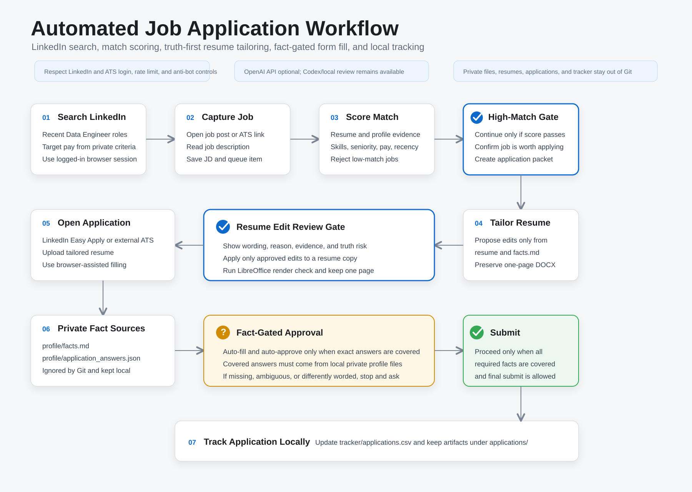

# Resume Optimizer

Local, privacy-first job application pipeline for browser-assisted discovery, match scoring, truthful resume tailoring, fact-gated application filling, and local application tracking.

The project keeps private job-search criteria, profile facts, application answers, resumes, application packets, and tracker data out of Git. Public files contain reusable tooling and templates; local private files drive the actual search and application decisions.



See [docs/folder_structure.md](docs/folder_structure.md) for the tracked,
private, and generated directory boundaries.

## Setup

Install LibreOffice for PDF export.

macOS:

```bash
brew install --cask libreoffice
```

Windows: install LibreOffice from https://www.libreoffice.org/download/. The page-check script looks for the standard `Program Files\LibreOffice\program\soffice.exe` install path, or any `soffice`/`soffice.exe` on `PATH`.

Create a virtual environment and install Python dependencies:

```bash
cd ResumeOptimizer
python -m venv .venv
.venv\Scripts\activate
python -m pip install -r requirements.txt
```

On macOS or Linux, activate the environment with `source .venv/bin/activate`.

Optional Azure OpenAI analysis:

```bash
export AZURE_OPENAI_ENDPOINT="https://your-resource.cognitiveservices.azure.com"
export AZURE_OPENAI_DEPLOYMENT="your-deployment-name"
export AZURE_OPENAI_API_KEY="..."
export AZURE_OPENAI_API_VERSION="2025-04-01-preview"
```

On Windows PowerShell, use `$env:NAME = "value"` instead of `export`.

For this local workspace, the pipeline can also read the Azure endpoint and key
from a private `keys.txt` file in `C:\Users\zicon\Repo\JobSearch` or from an
explicit `AZURE_OPENAI_KEYS_FILE` path. Keep that file ignored and local. The
file can be either:

```text
https://your-resource.cognitiveservices.azure.com
your-api-key
your-deployment-name
```

or:

```text
AZURE_OPENAI_ENDPOINT=https://your-resource.cognitiveservices.azure.com
AZURE_OPENAI_API_KEY=your-api-key
AZURE_OPENAI_DEPLOYMENT=your-deployment-name
```

If the deployment name is not in `keys.txt`, set it in PowerShell:

```powershell
$env:AZURE_OPENAI_DEPLOYMENT = "your-deployment-name"
```

Check whether the workflow is Azure-ready without printing secrets:

```powershell
python scripts/azure_status.py
```

`tailor.py` defaults to `--llm-provider auto`: it uses Azure OpenAI only when
Azure endpoint, key, and deployment settings are available, and otherwise writes
a conservative fallback scan for Codex/manual tailoring. The personal OpenAI API
path is disabled for this local workflow.

The scripts call the LLM API over HTTPS with `requests`, so they do not need an
OpenAI Python SDK.

## Privacy And Secret Safety

Keep private job-search data out of Git:

```text
resumes/master.docx
profile/facts.md
profile/application_answers.json
profile/search_criteria.md
applications/
outputs/
tracker/applications.csv
.env
```

Use `profile/facts.example.md`, `profile/application_answers.example.json`, `profile/search_criteria.example.md`, and `profile/portals.example.yml` as templates, then keep the real files local.

`DATA_CONTRACT.md` defines the public system layer versus the private local layer. Treat it as the rule for what can be pushed.

Before committing or pushing, run:

```bash
python scripts/security_check.py --fail-on-finding
python scripts/doctor.py
python scripts/verify_tracker.py
git status --short --ignored
```

The security check scans tracked and unignored files for common OpenAI keys, GitHub tokens, bearer tokens, and private-key blocks. It does not replace GitHub secret scanning, but it catches common local mistakes before push.

Recommended GitHub repository settings:

- Keep the repository private if it contains job-search automation, resume content, or personal workflow details.
- Enable secret scanning and push protection.
- Require pull-request review before merging to `main` if others get write access.
- Do not store API keys in GitHub Actions secrets unless a workflow genuinely needs them.
- Rotate any API key immediately if it is pasted into a tracked file, terminal transcript, issue, PR, or commit.

## Core Workflow

The current process runs in repeating discovery batches of up to 10:

1. Read private search rules from `profile/search_criteria.md`.
2. Check whether the current batch still contains open jobs.
3. If the previous batch is exhausted, search LinkedIn, direct employer career
   sites, and supported ATS platforms for current candidates.
4. Hard-screen and rank candidates, then immediately queue every verified match
   under one batch ID, stopping when the batch reaches 10. A partial batch is
   valid.
5. Process all queued jobs in score order through packet preparation, automatic
   approval of low-risk fact-bound resume edits, application filling, and
   tracking.
6. Count blocked or manual-handoff applications as iterated and continue to the
   next queued job.
7. Reconcile Outlook job-update emails with active tracker rows. Record
   application receipts, interview invitations, next-round notices, offers,
   and rejections without saving email bodies.
8. Start another discovery run only after every job in the current batch is
   submitted, skipped, expired, rejected, blocked, or otherwise handed off.

## Resume Inputs

Put your master resume here:

```text
resumes/master.docx
```

Put job text in:

```text
jobs/job.txt
```

Run a suggestion-only pass from pasted job text:

```bash
python scripts/tailor.py \
  --resume resumes/master.docx \
  --job jobs/job.txt \
  --profile profile/facts.md \
  --out outputs/tailored.docx \
  --dry-run
```

Or run from a job post link:

```bash
python scripts/tailor.py \
  --resume resumes/master.docx \
  --job-url "https://example.com/job-post" \
  --profile profile/facts.md \
  --out outputs/tailored.docx \
  --dry-run
```

Some job boards block automated fetching or require login. If that happens, paste the job description into `jobs/job.txt` and use `--job jobs/job.txt`.

## Job Search Queue

Keep jobs you want to evaluate in a local queue:

```bash
python scripts/job_queue.py add \
  --company "Example Co" \
  --role "Senior Data Engineer" \
  --source "LinkedIn" \
  --url "https://example.com/job" \
  --priority high \
  --batch-id "2026-06-06-01" \
  --match-score 86
```

List or inspect the queue:

```bash
python scripts/job_queue.py list
python scripts/job_queue.py next
python scripts/job_queue.py batch-status --target-size 10
```

The real queue lives at `jobs/queue.csv` and is ignored by Git. Use `jobs/queue.example.csv` as the portable template.

When one application state change should update both the queue and tracker, use:

```bash
python scripts/application_state.py \
  --company "Example Co" \
  --role "Senior Data Engineer" \
  --status application_started \
  --source "LinkedIn" \
  --url "https://example.com/job"
```

## Automated Search Pipeline

The project supports a staged automation loop:

1. Build LinkedIn search URLs from local private criteria.
2. Review LinkedIn results in a logged-in browser and add promising job URLs to `jobs/queue.csv`.
3. Score queued jobs by resume/profile keyword evidence, detected base pay, seniority, and post recency.
4. Prepare high-match application packets and proposed resume edits.
5. Review proposed resume edits in chat before generating the tailored resume.
6. Use browser-assisted form filling for the application, with gated auto-approval from private facts.
7. Track status in `tracker/applications.csv`.

Generate a LinkedIn search URL:

```bash
python scripts/linkedin_search.py
```

Open the generated searches directly without passing ampersands through
PowerShell or `cmd.exe`:

```powershell
.\.venv\Scripts\python.exe .\scripts\linkedin_search.py --open
```

Do not replace query separators (`&`) with `%26` or `&amp;`. That makes
LinkedIn interpret location and filters as part of the keyword phrase.

The command reads `profile/search_criteria.md` when that private file exists. Use CLI flags only when you want to override the local criteria for a one-off run.

LinkedIn discovery is intentionally browser-assisted. Use your own logged-in browser session, respect site controls, and add job URLs to the local queue instead of scraping around login or anti-bot protections.

Scan supported ATS feeds into the local queue:

```bash
cp profile/portals.example.yml profile/portals.yml
python scripts/ats_scan.py
```

The scanner supports Greenhouse, Ashby, Lever, and Workday public job feeds.
Greenhouse and Ashby use `board` slugs, Lever uses a `site` slug, and Workday
requires the employer's public CXS `api` URL plus its career-site `site` name.
Keep the real `profile/portals.yml` local because it can reveal target companies
and search strategy.

Score one job description or URL:

```bash
python scripts/match_score.py \
  --resume resumes/master.docx \
  --job-url "https://example.com/job-post"
```

Process queued jobs through the high-match gate:

```bash
python scripts/automation_pipeline.py \
  --resume resumes/master.docx \
  --min-score 75
```

When `profile/search_criteria.md` exists, `linkedin_search.py`, `match_score.py`, and `automation_pipeline.py` read local discovery filters and target pay from that private file. You can still override them with CLI flags.

High-match jobs are moved to `analyzed` and get an application packet under `applications/`. Low-match jobs are marked `rejected_low_match` in the queue and `rejected` in the tracker with the score reason.

## Tracker Maintenance

Inspect tracker status:

```bash
python scripts/tracker_tools.py status
```

Normalize common status aliases, remove duplicate rows, set follow-up dates, and list overdue follow-ups:

```bash
python scripts/tracker_tools.py normalize
python scripts/tracker_tools.py dedup
python scripts/tracker_tools.py set-followups --days 7
python scripts/tracker_tools.py overdue
```

Validate tracker structure and local file references:

```bash
python scripts/verify_tracker.py
```

## Application Pipeline

Prepare an application packet from a job URL:

```bash
python scripts/run_application_pipeline.py \
  --company "Example Co" \
  --role "Senior Data Engineer" \
  --job-url "https://example.com/job" \
  --resume resumes/master.docx \
  --llm-provider auto
```

This creates the application folder, stores the job description, runs fit analysis, writes `proposed_edits.json`, updates the tracker to `analyzed`, and stops for chat review. If Azure OpenAI is unavailable, `proposed_edits.json` records the fallback reason and leaves actual rewrite tailoring for Codex/manual review.

After you approve edits, save them as an accepted-edits JSON file and run:

```bash
python scripts/run_application_pipeline.py \
  --company "Example Co" \
  --role "Senior Data Engineer" \
  --job-url "https://example.com/job" \
  --resume resumes/master.docx \
  --accepted-edits applications/Example_Co_Senior_Data_Engineer/accepted_edits.json
```

That generates the tailored resume, runs the one-page check, copies the final DOCX into `tailored_resumes/`, and updates `tracker/applications.csv` to `resume_ready`.

Apply accepted edits from a JSON file:

```bash
python scripts/tailor.py \
  --resume resumes/master.docx \
  --job jobs/job.txt \
  --profile profile/facts.md \
  --accepted-edits outputs/accepted_edits.json \
  --out outputs/tailored.docx
```

Convert and check one-page PDF:

```bash
python scripts/check_one_page.py --docx outputs/tailored.docx
```

Run the tracker as a live local dashboard:

```bash
python scripts/live_tracker.py
```

Open `http://127.0.0.1:8765/`. The page remains local and refreshes
automatically when `tracker/applications.csv` changes. The dashboard includes
active applications, interview stages, follow-up actions, mailbox-linked
updates, filters, search, and inline local editing.

## Outlook Status Reconciliation

The Codex Outlook Email connector is the mailbox access layer. The local repo
does not store Microsoft credentials or mailbox tokens.

For each run:

1. Read active company and role names from `tracker/applications.csv`.
2. Search or list recent Outlook messages using company names, recruiter
   domains, and job-status terms.
3. Classify only clear outcomes: application received, interview invitation,
   interview completed, next round, offer, or rejection.
4. Record subject, received date, sender/contact, Outlook message link, and the
   resulting tracker state. Do not copy message bodies into the repo.
5. Leave ambiguous messages unchanged and surface them for review.

Record a confirmed mailbox event:

```bash
python scripts/mailbox_reconcile.py \
  --company "Example Co" \
  --role "Senior Data Engineer" \
  --event next_round \
  --received-date "2026-06-06" \
  --subject "Next interview" \
  --message-url "https://outlook.live.com/..." \
  --contact-name "Recruiter Name"
```

Personal Microsoft accounts may not support Graph full-text mailbox search.
When that occurs, use date-filtered message listing plus subject filters.

## Resume-Only Workflow

Use this narrower path when you only need a tailored resume and are not running the full search/application pipeline:

1. Run `tailor.py --dry-run`.
2. Review `outputs/suggestions.json`.
3. Copy only edits you accept into `outputs/accepted_edits.json`.
4. Run `tailor.py` with `--accepted-edits`.
5. Run `check_one_page.py`.
6. If it exceeds one page, shorten low-priority bullets instead of shrinking text aggressively.

## Application Packet Layout

Use one folder per application under `applications/`:

```text
applications/company-role/
  Zicong_Liang_<Company>_<Role>_Resume.docx
  fit_analysis.json
  job_description.txt
  proposed_edits.json
  render_check/
    Zicong_Liang_<Company>_<Role>_Resume.pdf
```

Cover letters and recruiter messages are optional. Create them only when explicitly requested.

Use the shared checklist instead of creating one checklist per job:

```text
applications/APPLICATION_REVIEW_CHECKLIST.md
```

Keep `outputs/` for temporary scratch files, such as `suggestions.json`, not final application packets.

## Tailored Resume Collection

Final tailored resumes are also copied into:

```text
tailored_resumes/
```

Use this folder when you just want the final resume files in one place. Each application folder remains the complete packet with fit analysis, job description, proposed edits, and render-check output.

## Tracker

The tracker is a local CSV at:

```text
tracker/applications.csv
```

Statuses:

```text
queued
analyzed
resume_ready
application_started
submitted
interview
offer
rejected
closed
```

Use `scripts/tracker.py` to update it manually when you start or submit an application.
Use `scripts/application_state.py` when the same state change should also update `jobs/queue.csv`.

## Browser-Assisted Form Filling

Create a private application-answer file from the example:

```bash
cp profile/application_answers.example.json profile/application_answers.json
```

Fill `profile/application_answers.json` with only facts you are comfortable reusing in job applications. The real file is ignored by Git.

The browser-assisted flow may prefill:

- standard contact fields
- work authorization fields when the wording exactly matches your private facts
- race, gender, veteran, and disability self-ID only from explicit values in the private file
- legal/privacy acknowledgements and final submit only when explicitly approved by `profile/application_answers.json` and consistent with `profile/facts.md`

The flow must stop for review on:

- custom essay or short-answer questions
- unusual sponsorship wording
- legal/privacy/background-check wording not covered by the private policy
- any final-submit case where entered facts are missing, ambiguous, or inconsistent with the private profile

Current policy: legal/privacy/self-ID/final-submit gates are auto-approved only when the exact answer or approval is covered by `profile/facts.md` or `profile/application_answers.json`. If a form asks for anything not covered there, stop and ask before continuing.

For real applications, follow the reusable runbook:

```text
docs/real_application_runbook.md
```

It captures the effective sequence, known friction points, and submit-gate checklist from the first LinkedIn Easy Apply and external ATS applications.
