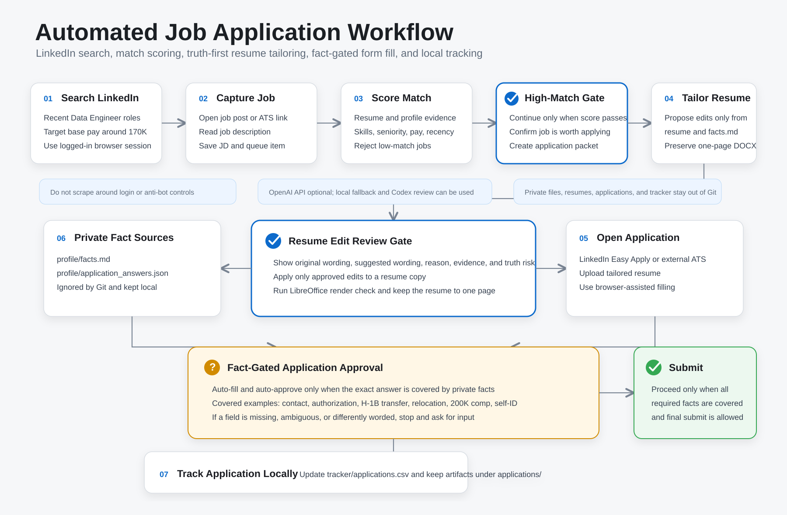

# Resume Optimizer

Local Mac workflow for tailoring a one-page resume to a job description while preserving the original DOCX format and avoiding unsupported claims.



## Setup

Install LibreOffice for PDF export:

```bash
brew install --cask libreoffice
```

Create a virtual environment and install Python dependencies:

```bash
cd resume-optimizer
python3 -m venv .venv
source .venv/bin/activate
pip install -r requirements.txt
```

Optional OpenAI analysis:

```bash
export OPENAI_API_KEY="..."
export OPENAI_MODEL="gpt-5.1"
```

The script calls the OpenAI API over HTTPS with `requests`, so it does not need the OpenAI Python SDK.

## Usage

Put your master resume here:

```text
resumes/master.docx
```

Put job text in:

```text
jobs/job.txt
```

Run a suggestion-only pass from pasted job text:

```bash
python scripts/tailor.py \
  --resume resumes/master.docx \
  --job jobs/job.txt \
  --profile profile/facts.md \
  --out outputs/tailored.docx \
  --dry-run
```

Or run from a job post link:

```bash
python scripts/tailor.py \
  --resume resumes/master.docx \
  --job-url "https://example.com/job-post" \
  --profile profile/facts.md \
  --out outputs/tailored.docx \
  --dry-run
```

Some job boards block automated fetching or require login. If that happens, paste the job description into `jobs/job.txt` and use `--job jobs/job.txt`.

## Job Search Queue

Keep jobs you want to evaluate in a local queue:

```bash
python scripts/job_queue.py add \
  --company "Example Co" \
  --role "Senior Data Engineer" \
  --source "LinkedIn" \
  --url "https://example.com/job" \
  --priority high
```

List or inspect the queue:

```bash
python scripts/job_queue.py list
python scripts/job_queue.py next
```

The real queue lives at `jobs/queue.csv` and is ignored by Git. Use `jobs/queue.example.csv` as the portable template.

## Application Pipeline

Prepare an application packet from a job URL:

```bash
python scripts/run_application_pipeline.py \
  --company "Example Co" \
  --role "Senior Data Engineer" \
  --job-url "https://example.com/job" \
  --resume resumes/master.docx
```

This creates the application folder, stores the job description, runs fit analysis, writes `proposed_edits.json`, updates the tracker to `analyzed`, and stops for chat review.

After you approve edits, save them as an accepted-edits JSON file and run:

```bash
python scripts/run_application_pipeline.py \
  --company "Example Co" \
  --role "Senior Data Engineer" \
  --job-url "https://example.com/job" \
  --resume resumes/master.docx \
  --accepted-edits applications/Example_Co_Senior_Data_Engineer/accepted_edits.json
```

That generates the tailored resume, runs the one-page check, copies the final DOCX into `tailored_resumes/`, and updates `tracker/applications.csv` to `resume_ready`.

Apply accepted edits from a JSON file:

```bash
python scripts/tailor.py \
  --resume resumes/master.docx \
  --job jobs/job.txt \
  --profile profile/facts.md \
  --accepted-edits outputs/accepted_edits.json \
  --out outputs/tailored.docx
```

Convert and check one-page PDF:

```bash
python scripts/check_one_page.py --docx outputs/tailored.docx
```

## Workflow

1. Run `tailor.py --dry-run`.
2. Review `outputs/suggestions.json`.
3. Copy only edits you accept into `outputs/accepted_edits.json`.
4. Run `tailor.py` with `--accepted-edits`.
5. Run `check_one_page.py`.
6. If it exceeds one page, shorten low-priority bullets instead of shrinking text aggressively.

## Application Packet Layout

Use one folder per application under `applications/`:

```text
applications/company-role/
  Zicong_Liang_<Company>_<Role>_Resume.docx
  fit_analysis.json
  job_description.txt
  proposed_edits.json
  render_check/
    Zicong_Liang_<Company>_<Role>_Resume.pdf
```

Cover letters and recruiter messages are optional. Create them only when explicitly requested.

Use the shared checklist instead of creating one checklist per job:

```text
applications/APPLICATION_REVIEW_CHECKLIST.md
```

Keep `outputs/` for temporary scratch files, such as `suggestions.json`, not final application packets.

## Tailored Resume Collection

Final tailored resumes are also copied into:

```text
tailored_resumes/
```

Use this folder when you just want the final resume files in one place. Each application folder remains the complete packet with fit analysis, job description, proposed edits, and render-check output.

## Tracker

The tracker is a local CSV at:

```text
tracker/applications.csv
```

Statuses:

```text
queued
analyzed
resume_ready
application_started
submitted
rejected
interview
closed
```

Use `scripts/tracker.py` to update it manually when you start or submit an application. Keep final submission manual unless you explicitly choose browser-assisted form filling for a specific job.

## Browser-Assisted Form Filling

Create a private application-answer file from the example:

```bash
cp profile/application_answers.example.json profile/application_answers.json
```

Fill `profile/application_answers.json` with only facts you are comfortable reusing in job applications. The real file is ignored by Git.

The browser-assisted flow may prefill:

- standard contact fields
- work authorization fields when the wording exactly matches your private facts
- race, gender, veteran, and disability self-ID only from explicit values in the private file

The flow may draft, but must stop for review on:

- custom essay or short-answer questions
- unusual sponsorship wording
- legal attestations
- final submit

Legal attestations use `review_required` by default. Do not change `allow_click_legal_attestations` or `allow_final_submit` to `true` unless you intentionally want to remove those guardrails.
